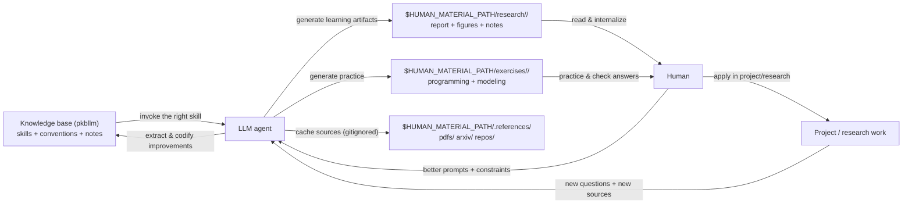

# pkbllm — Personal Knowledge Base for better LLM–Human interaction

`pkbllm` is a curated repository of **agent skills** (reusable instruction sets) and a lightweight
**knowledge organization** scheme designed to improve LLM–human interaction:

- Humans use LLMs more effectively by invoking the right skill at the right time.
- LLMs keep human-facing artifacts organized so you can iterate without losing context.

This repo is compatible with the Skills CLI (`npx skills`) and maintains a clean separation between
canonical skill sources and the generated distribution mirror.

## What this enables

**For humans**
- A repeatable workflow for generating and maintaining materials (slides, paper notes, exercises).
- A stable place (`$HUMAN_MATERIAL_PATH`) where outputs live, independent of the pkb repo checkout.

**For LLM agents**
- A reliable “operating system” of skills (`uv-*`) covering planning, execution, review, research,
  and human-facing production.
- Conventions for where to put outputs and where to put bulky downloads/clones.

## Visual overview



## Quickstart

List available skills:

```bash
npx skills add . --list
```

Install all skills to Codex (project scope):

```bash
npx skills add . -a codex --skill '*' -y
```

Notes:

- Always specify a single target agent via `-a` (e.g. `-a codex`). Avoid installing “for all agents”, which can create a pile of
  local tool-state folders (now gitignored).
- Prefer project-scope installs over global installs unless you intentionally want user-level state.

See `INSTALL.md` for more install options and environment variables.

## How to use this repo (recommended workflow)

1) Start a session by using `uv-using-pkb` to discover the right skill(s).

2) If you generate human-facing artifacts, initialize a dedicated materials repo once:
- Use `uv-init-human-material-repo` to create `$HUMAN_MATERIAL_PATH` with expected structure.

3) Keep outputs organized:
- Tracked outputs: `$HUMAN_MATERIAL_PATH/{slides,research,manuscripts,exercises}/...`
- Downloads/clones (gitignored): `$HUMAN_MATERIAL_PATH/.references/{pdfs,arxiv,repos}/...`

4) Adjust paths if needed:
- Repo override: `$HUMAN_MATERIAL_PATH/.agents/config.toml`
- User default: `~/.agents/config.toml`

## Repo layout (canonical vs generated)

Canonical (curated) skill sources:

- `common/` — shared cross-domain skills (e.g. “how to use pkb”)
- `productivity/` — engineering workflow skills
- `knowledge/` — domain and research skills
- `human/` — skills for generating human-facing materials
- `bootstrap/` — scripts to maintain this repo

Generated distribution mirror:

- `skills/` — generated mirror of all skills for `npx skills` consumers (do not edit)

Reference clones (optional, local only):

- `.references/` — one-time upstream clones used for importing; skills evolve in this repo afterward

## Maintaining the `skills/` mirror (contributors)

After adding/editing canonical skills, regenerate the mirror and refresh README indexes:

```bash
python bootstrap/scripts/update_skills_mirror.py all
```

## License

- Repository license: `LICENSE`
- Third-party notices: `THIRD_PARTY_NOTICES.md`

## <TABLE>
<!-- PKBLLM_TABLE_START -->
| Path | Type | Description |
| --- | --- | --- |
| `common/` | dir | Shared cross-domain skills |
| `knowledge/` | dir | Domain and research skills |
| `productivity/` | dir | Engineering workflow skills |
| `human/` | dir | Skills for human-facing materials |
| `bootstrap/` | dir | Repository maintenance scripts |
| `skills/` | dir | Generated Skills-CLI mirror (do not edit) |
| `INSTALL.md` | file | Installation instructions |
| `LICENSE` | file | Repository license |
| `THIRD_PARTY_NOTICES.md` | file | Third-party notices and licenses |
<!-- PKBLLM_TABLE_END -->
