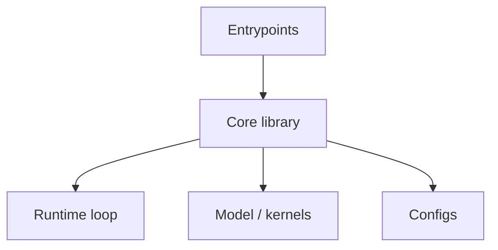

# Repo analysis: <repo name>

**Repo:** <url>  
**Local clone:** <path>  
**Commit:** <sha>  
**LLM-related:** yes | no (signals: <signals>)

## TL;DR

<one paragraph>

## What problem it solves

- <problem 1>
- <problem 2>

## Architecture map



### Module map

| Path | Role | Notes |
| --- | --- | --- |
| <path> | <role> | <notes> |

## Primary workflows

### Build / install

- <command>

### Entrypoints

- CLI:
- Server:
- Training:

### Configuration surface

| Mechanism | Where | Examples |
| --- | --- | --- |
| env vars | <path> | <names> |
| config file | <path> | <keys> |
| CLI flags | <path> | <flags> |

## Key components (with code locations)

| Component | Location | Responsibility |
| --- | --- | --- |
| <name> | `<path>:<line>` | <what it does> |

## LLM deep dive (only if LLM-related)

### Prefill vs decode loop (real nesting)

```python
# Use the repo’s real structure; annotate with file:line.
while server_running:
    batch = scheduler.form_batch()
    # prefill pass (prompt)
    # decode loop (token-by-token)
```

### KV cache

- Layout:
- Update path:
- Eviction/paging:
- Memory accounting:

### Scheduler / batching

- Queueing:
- Chunking:
- Preemption:

### Sampling / decoding

- Logits processing:
- RNG / determinism:

### Hot kernels / operators

- Attention:
- GEMMs:
- Quantization:

## Extension points (safe places to modify)

| Goal | Recommended place | Why |
| --- | --- | --- |
| <feature> | <path> | <reason> |

## Pitfalls / time sinks

- <pitfall 1>
- <pitfall 2>

## Open questions

- <question>

