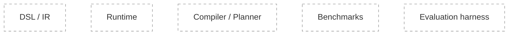

# Progress

## Component status diagram

Update node classes as you progress (`todo` → `doing` → `done`).

## Execution log

| Date | Change | Evidence |
| --- | --- | --- |
| <YYYY-MM-DD> | <what changed> | <command / PR / link> |

