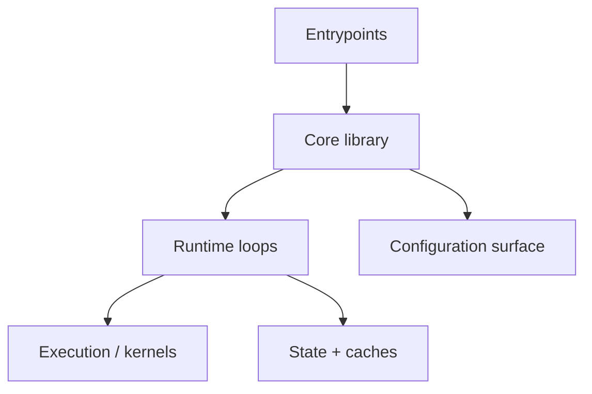

# Repo analysis: {repo_name}

**Repo:** {repo_url_or_path}  
**Local clone:** {local_clone_path}  
**Commit:** {git_sha}  
**LLM-related:** {yes_or_no} (signals: {signals})

## TL;DR (5–8 lines)

{one_paragraph_summary}

## What problem it solves

- {problem_1}
- {problem_2}

## Architecture map (one diagram)



## Module map (table)

| Path | Role | Notes |
| --- | --- | --- |
| {path_1} | {role_1} | {notes_1} |
| {path_2} | {role_2} | {notes_2} |

## Primary workflows

### Install / build

- {command_1} (what it does: {notes})
- {command_2} (what it does: {notes})

### Entrypoints (how to run)

- CLI: `{path:line}` (what it does: {notes})
- Server: `{path:line}` (what it does: {notes})
- Benchmarks/examples: `{path:line}` (what it does: {notes})

### Configuration surface (how to control it)

| Mechanism | Where | Examples |
| --- | --- | --- |
| env vars | `{path}` | `{NAMES}` |
| config files | `{path}` | `{keys}` |
| CLI flags | `{path}` | `{flags}` |

## Key components (with code locations)

Provide at least 6–10 entries with file:line pointers.

| Component | Location | Responsibility |
| --- | --- | --- |
| runtime loop | `{path:line}` | {what it does} |
| scheduler | `{path:line}` | {what it does} |
| KV cache | `{path:line}` | {what it does} |
| sampling | `{path:line}` | {what it does} |
| attention backend | `{path:line}` | {what it does} |
| config parser | `{path:line}` | {what it does} |

## LLM deep dive (only if LLM-related)

This section must be grounded in real code: include file:line pointers and avoid generic descriptions.

### Prefill vs decode loop (real nesting)

Write pseudocode that matches the repo’s actual call nesting and annotate key lines:

```text
while running:
  batch = scheduler.form_batch()            # {path:line}
  if batch.has_prefill:
    model.forward_prefill(batch)            # {path:line}
  while batch.has_decode:
    logits = model.forward_decode(batch)    # {path:line}
    token = sampler.sample(logits)          # {path:line}
    kv_cache.append(token)                  # {path:line}
```

### KV cache

- Layout/data structures: `{path:line}`
- Update path (append, swap, evict): `{path:line}`
- Paging / block tables (if any): `{path:line}`
- Memory accounting: `{path:line}`

### Scheduler / batching

- Queueing + priorities: `{path:line}`
- Chunking / preemption: `{path:line}`
- Backpressure / admission control: `{path:line}`

### Sampling / decoding

- Logits processing: `{path:line}`
- Parameters: temperature/top_p/top_k/repetition: `{path:line}`
- Determinism / seeds: `{path:line}`

### Kernel hotspots / backends

- Attention backend(s): `{path:line}`
- GEMM / quantization backends: `{path:line}`
- Optional libs: `{path:line}`

## Extension points (safe places to modify)

| Goal | Recommended place | Why |
| --- | --- | --- |
| {feature_goal} | `{path}` | {reason} |

## Pitfalls / time sinks

- {pitfall_1} (how to detect: {signal}; fix: {action})
- {pitfall_2} (how to detect: {signal}; fix: {action})

## Open questions

- {question_1}
- {question_2}

## Self-review checklist (before calling it “done”)

- TL;DR is specific and accurate (not generic marketing).
- Module map includes real paths and roles.
- Key components table has file:line pointers and correct responsibilities.
- If LLM-related: prefill/decode + KV cache + scheduler + sampling are described with code pointers.
- No placeholder markers like `<...>` remain anywhere in this file.

