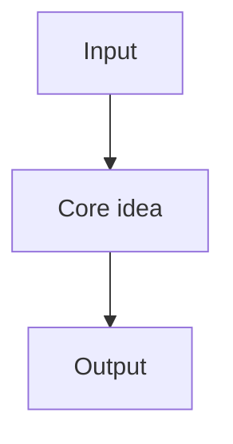

# {NN} — {chapter_title}

## Objectives

- {objective_1}
- {objective_2}

## Conceptual model



## Code tour

- `{path:line}` — {what to read}
- `{path:line}` — {what to read}

## Runnable example

Command:

```bash
python {examples_path}/your_example.py
```

Expected output (captured from a real run):

```text
{expected_output_excerpt}
```

## Exercises

1) {exercise_prompt_1}
2) {exercise_prompt_2}

